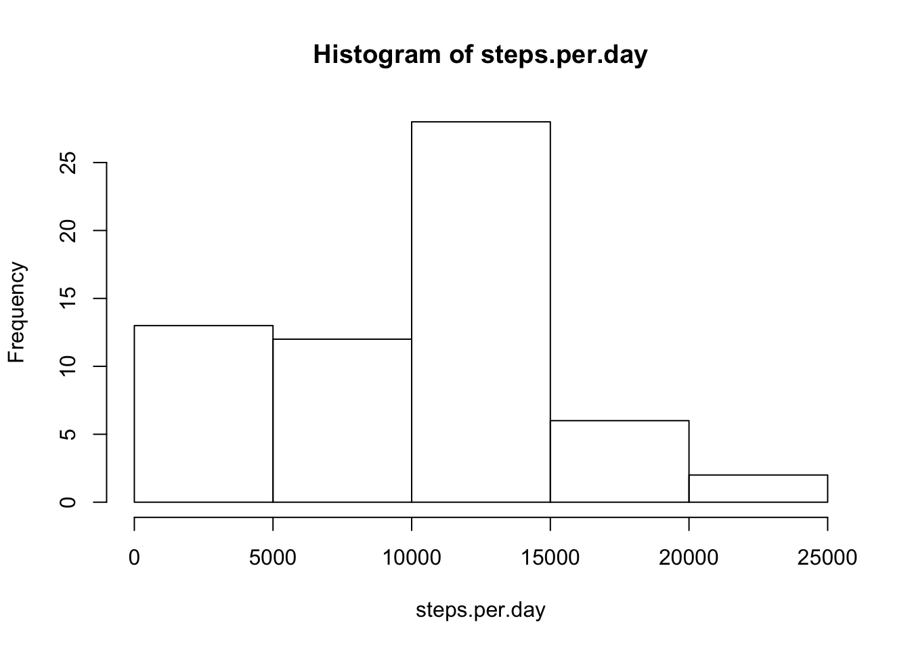

This is an R Markdown document. Markdown is a simple formatting syntax
for authoring HTML, PDF, and MS Word documents. For more details on
using R Markdown see <http://rmarkdown.rstudio.com>.

When you click the **Knit** button a document will be generated that
includes both content as well as the output of any embedded R code
chunks within the document. You can embed an R code chunk like this:

<h2>
Loading and preprocessing the data
</h2>
    library(plyr)
    data <- read.csv(file="activity.csv",head=T,stringsAsFactors=FALSE )

What is mean total number of steps taken per day?

-   Calculate the total number of steps taken per day

<!-- -->

    # Calculate the total number of steps taken per day
    steps.per.day <- tapply(data$steps, data$date, "sum", na.rm = TRUE)
    hist(steps.per.day)

 
Calculate and report the mean and median of the total number of steps
taken per day

    mean(steps.per.day)

    ## [1] 9354.23

    median(steps.per.day)

    ## [1] 10395

<h2>
What is the average daily activity pattern?
</h2>
    # What is the average daily activity pattern?
    avgstepsinterval <- tapply(data$steps, data$interval, "mean", na.rm = TRUE)

    # Make a time series plot (i.e. type = 'l') of the 5-minute interval
    # (x-axis) and the average number of steps taken, averaged across all days
    # (y-axis)
    avgstepsinterval <- tapply(data$steps, data$interval, "mean", na.rm = TRUE)
    plot(names(avgstepsinterval), avgstepsinterval, type = "l")

    # Which 5-minute interval, on average across all the days in the dataset,
    # contains the maximum number of steps?
    which.max(avgstepsinterval)

    ## 835 
    ## 104

<h2>
Imputing missing values
</h2>
    #Imputing missing values

    #Calculate and report the total number of missing values in the dataset (i.e. the total number of rows with NAs)
    sum(is.na(data$steps))

    ## [1] 2304

    # Merge original data with the average by interval data

    # Find the NA positions
    na_pos <- which(is.na(data$steps))

    mean_vec <- rep(mean(data$steps, na.rm=TRUE), times=length(na_pos))

    #Create a new dataset that is equal to the original dataset but with the missing data filled in.
    # Replace the NAs by the means
    data[na_pos, "steps"] <- mean_vec

    #Compute the total number of steps each day
    summedData <- aggregate(data$steps, by=list(data$date), FUN=sum)

    # Rename the attributes
    names(summedData) <- c("date", "total")

    # Compute the histogram of the total number of steps each day
    hist(summedData$total, 
         breaks=seq(from=0, to=23000, by=1500),
         xlab="Total numbers of steps", 
         col="blue",    
         ylim=c(0, 50), 
         main="The total number of steps taken each day")

<h2>
Are there differences in activity patterns between weekdays and
weekends?
</h2>
    # Are there differences in activity patterns between weekdays and weekends?
    library(lattice)
    weekdays <- c("Monday", "Tuesday", "Wednesday", "Thursday", "Friday")
    data$dow = as.factor(ifelse(is.element(weekdays(as.Date(data$date)), weekdays), 
        "Weekday", "Weekend"))
    intervalSteps <- aggregate(steps ~ interval + dow, data, mean)
    xyplot(intervalSteps$steps ~ intervalSteps$interval | intervalSteps$dow, main = "Average Steps per Day by Interval", 
        xlab = "Interval", ylab = "Steps", layout = c(1, 2), type = "l")

